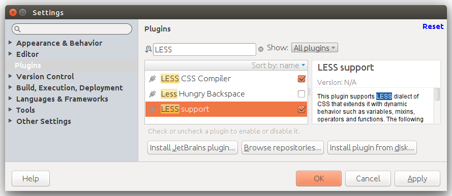
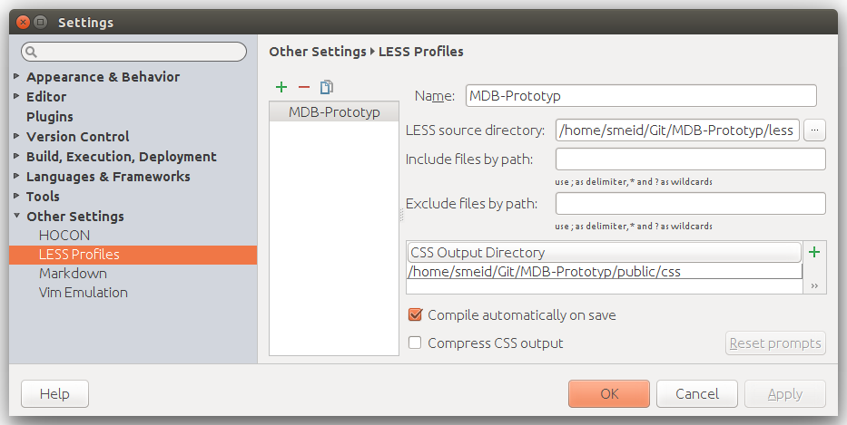

# Interface (customized for MDB Prototype)

We develop a Semantic Programming Ontology (SPrO; https://github.com/SemanticProgramming/SPrO) that is used for software programming. SPrO can be used like a programming language with which one can control a data-centric Semantic Web application by describing it within a corresponding source code ontology. With the terms from SPrO you can describe the graphical user interface (GUI), data representations, user interactions, and all workflow processes of a Semantic Web application. The Java Interpreter (https://github.com/SemanticProgramming/Interpreter) functions as an interpreter that dynamically interprets and executes the descriptions in a source code ontology by interpreting them as declarative specifications. This Interface provides the interface. It has been customized to meet the requirements for semantic Morph·D·Base (https://github.com/SemanticProgramming/SemMorphDBase).

Currently, the following **general functions** have been implemented:
* creation of all relevant HTML/CSS entities based on the design guidelines catalogue of semantic Morph·D·Base;
* automated generation of the GUI based on the specifications in the source code ontologies;
* message system: error and success messages from the WebSocket are displayed in the GUI;
* dynamic updating of the GUI based on user-actions and WebSocket triggers;
* data binding: changes in the GUI are send back to the WebSocket for validation and storage.

In addition to these general functions, the following tools have been developed, which will be used in the new module for **formalized morphological descriptions** in Morph·D·Base: 
* partonomy tool: partonomy browser that not only allows describing an organism as the collection of its parts but also provides a navigation tree to the different sections of the description (see 2.3.4); 
* text annotation tool: uses about 100 ontologies provided by the NCBO BioPortal (see http://bioportal.bioontology.org/) for automated text annotation;
* image annotation tool: bundles OpenLayers (https://openlayers.org/) and an image server tool developed at Hochschulbibliothekszentrum NRW (https://github.com/hbz/DeepZoomService) to allow users to define regions of interest for annotating high-res images.

Further information on the project is available at http://escience.biowikifarm.net - feel free to contact us at 
dev@morphdbase.de

This repository contains the Interface for Semantic Programming based on the Semantic Programming Ontology (SPrO). For Semantic Programming you also need the Semantic Programming Ontology (SPrO; https://github.com/SemanticProgramming/SPrO) and the Java Interpreter (https://github.com/SemanticProgramming/Interpreter). Basic functionalities are described in the SOCCOMAS source code ontology (SC-Basic; https://github.com/SemanticProgramming/SOCCOMAS) and can be re-used for your Semantic Web application.

**Please be aware that this project is ongoing research! This code is for demonstration purposes only. Do not use
 in production environment!**
 

## Server requirements:
We are using the MEAN stack:

- **M**ongoDB, a NoSQL database
- **E**xpress.js, a web application framework that runs on Node.js
- **A**ngular.js, a JavaScript MVC framework that runs in browser JavaScript engines
- **N**ode.js, an execution environment for event-driven server-side and networking applications

Any platform with an up-to-date MEAN stack is fine. We mainly used Ubuntu 14.04 during development. 
All installing instructions for 3rd party software refers to this plattform. We recommend using a web server
like nginx or apache to serve the Angular application in productive mode.

## End user requirements
End users access the application using their web browser. To use all features a current browser is recommended: 

  * Chrome 62 or newer
  * Firefox 57 or newer
  * Safari 10 or newer
  * Android 5 or newer
  * iOS 9.3 or newer
  * Microsoft Edge
  * Internet Explorer 11 (depricated, not 100% supported for some CSS3)

## Developer Requirements
We developed using the IntelliJ IDEA running on Ubuntu 14.04. Some information is specific for this ide an can be
ignored if you prefere a different ide. 

## Installation

#### Get GIT repository:
Clone via bash...

    user@mdb:~$ git clone ssh://git@git.morphdbase.de:6020/sandra/MDB-Prototyp.git

#### Install MongoDB, NodeJS and npm, if necessary, and check, if mongodb is running:
Ubuntu 14 unfortunately comes with an outdated NodeJS version (0.1.x), so we have to update to a current version right after installation.
Node 6.1.0 or higher is recommended. 

    user@mdb:~$ sudo apt-get install mongodb nodejs npm
    user@mdb:~$ sudo npm cache clean -f
    user@mdb:~$ sudo npm install -g n
    user@mdb:~$ sudo n 4.4.2
    user@mdb:~$ sudo service mongodb status    

#### Set node as an alias for nodejs
Might be depricated if you use "n" to install nodeJS ...

    user@mdb:~$ sudo ln -sf /usr/local/n/versions/node/4.4.2/bin/node /usr/bin/node

    
#### Install via npm: bower as angularjs package manager and nodemon
During development nodemon is handy to launch the angular application as it restarts the application automatically if
a file changes. 

Usage:

nodemon server.js
        
    user@mdb:~$ sudo npm install -g bower nodemon
    
    
#### Install forever to run an monitor js applications in production mode:
Forever (re-)starts and monitors JavaScript applications. See start_stop.sh sample script (please change variables to
meet your own needs).

Usage: 

forever start --uid 'some_name_for_the_application' -a -w server.js" # Start application 
forever stop 'some_name_for_the_application'                         # Stop the application
forever list                                                         # List all applications watched by forever
forever stopall                                                      # Stop all applications watched by forever
    
    user@mdb:~$ sudo npm install forever -g               

#### Then, change directory to folder 'MDB-Prototyp' (same folder as package.json) and  install NodeJS and Angular libraries:

    user@mdb:~$ cd MDB-Prototyp/
    user@mdb:~$ npm install

#### At this point the LESS configuration within the IntelliJ IDEA has to be configured, to compile our custom LESS File (mdb.less, includes bootstrap.less) to CSS

First, install LESS Plugins, if necessary:

    IDEA --> Settings (STRG/ALT/S) --> Plugins

If no LESS Plugins are listed, go to "Browse repositories".

    IDEA --> Settings (STRG/ALT/S) --> Other Settings --> LESS Profiles

    - + new Profile
        - LESS source directory: /home/.../MDB-Prototyp/less
        - + new CSS Output Directory
            - /home/.../MDB-Prototyp/public/css
            
    x Compile automatically on save
    
    => APPLY!

  
#### Summary

    git clone ssh://git@git.morphdbase.de:6020/sandra/MDB-Prototyp.git    
    sudo apt-get install mongodb                # used for passport    
    sudo service mongodb status                 # check if mongodb is running    
    sudo apt-get install nodejs npm             # install nodejs and node package manager
    sudo ln -s /usr/bin/nodejs /usr/bin/node    # create 'node' symlinc for legathy packages  (depricated)
    sudo npm install -g bower                   # install bower (global), the angular package manager    
    sudo npm install forever -g                 # CLI tool for ensuring that a given script runs continuously
    sudo npm install -g nodemon                 # install nodemon (global), restarts server after changes automatically    
    npm install                                 # install node packages
 
 
## API Keys
You need API keys to access certain 3rd party web services. Find the following strings and insert your own API keys:

- BioPortal API Key: https://data.bioontology.org/annotator?apikey=[YOUR BIOONTOLOGY  API  KEY]
  

## Running the app

### Check, if mongodb is running:

    user@mdb:~$ sudo service mongodb status 
      
If not, start mongodb:

    user@mdb:~$ mongod
or

    user@mdb:~$ mongod --dbpath /srv/mongodb/    # custom db-path

### Finally, you should be able to start the server:

#### Local

    user@mdb:~$ node server.js
    
... or by using Nodemon (restarts the server upon change):

    user@mdb:~$ nodemon server.js

#### Forever process via ssh on server

    user@server:~$ forever stopall
    user@server:~$ forever start --uid "mdb-proto" --minUptime 10000 --spinSleepTime 10000 -a -w server.js
        
#### Forever process via ssh on ontology server

    user@ontology:~$ sh /home/smeid/mdb-prototype/start_proto.sh

### Directory Layout

    bower_components/       --> install folder of bower paketmanager (angularjs modules)
    node_modules/           --> install folder of npm paketmanager (nodejs modules)
    less/                   --> custom LESS files
    public/                 --> all of the files to be used in on the client side
      bower/                --> several angular libs, copied from bower_components
      css/                  --> css files
        app.css             --> default stylesheet
        mdb.css             --> custom bootstrap css generated from less files
      img/                  --> image files
      js/                   --> javascript files
        app.js              --> declare top-level app module
        controllers.js      --> application controllers
        directives.js       --> custom angular directives
        filters.js          --> custom angular filters
        services.js         --> custom angular services
        utilities.js        --> custom mdb code snippets
    server/
        models/
            user.js         --> user model for mongodb
        routes/
            api.js          --> route for login/logout/registration
            index.js        --> route for serving HTML pages and partials
    unittests-               -> unit testing
    views/
      index.html            --> main page for app
      partials/             --> angular view partials
        index.html
        entry.html
        ...
    package.json            --> set up and configure node packages (npm install)
    bower.json              --> set up and configure angular packages (bower install)
    server.js               --> app config

        
        
## Unit testing

Unit tests are located at [project_root]/unittests. Use InteliJ to run Karma unit tests or start from terminal:

     user@mdb:~$ [project_root]/node_modules/karma/bin/karma --configFile=[project_root]/karma.conf.js start

> “Well, I’ll just launch the app and see if everything works. We’ve never had any problem doing that.”
> – No one ever

The Angular team at Google provides two tools for testing Angular applications: 

- Karma, a test runner for unit testing, and
    http://karma-runner.github.io/0.12/intro/installation.html

- Protractor, a test framework for writing end-to-end (E2E) tests.

#### Further information:
- https://blog.logentries.com/2015/01/unit-testing-with-karma-and-jasmine-for-angularjs/
- http://karma-runner.github.io/0.10/index.html
- https://www.airpair.com/angularjs/posts/testing-angular-with-karma
- http://jasmine.github.io/edge/introduction.html
- https://www.npmjs.com/package/karma-detect-browsers
- http://www.sitepoint.com/unit-testing-angularjs-services-controllers-providers/
- http://andyshora.com/unit-testing-best-practices-angularjs.html
- http://www.smashingmagazine.com/2014/10/07/introduction-to-unit-testing-in-angularjs/
- https://bardevblog.wordpress.com/2013/07/28/setting-up-angularjs-angular-seed-node-js-and-karma/

### Install Karma and plugins:

The recommended approach is to install Karma (and all the plugins your project needs) locally in the project's directory.

    # Install Karma:
    user@mdb:~$ npm install karma --save-dev

    # Install plugins that your project needs:
    user@mdb:~$ npm install karma-jasmine karma-chrome-launcher karma-phantomjs-launcher --save-dev

#### Configure Karma
-  configure your karma.conf.js file using this guide:
    
    http://karma-runner.github.io/0.12/intro/configuration.html
        
        smeid@hulk:~/Git/mdb-nodeangular$ karma init

        Which testing framework do you want to use ?
        Press tab to list possible options. Enter to move to the next question.
        > jasmine

        Do you want to use Require.js ?
        This will add Require.js plugin.
        Press tab to list possible options. Enter to move to the next question.
        > no

        Do you want to capture any browsers automatically ?
        Press tab to list possible options. Enter empty string to move to the next question.
        > Firefox
        > Chrome
        > Safari
        > Opera
        >

        What is the location of your source and test files ?
        You can use glob patterns, eg. "js/*.js" or "test/**/*Spec.js".
        Enter empty string to move to the next question.
        > public/js/*.js
        > unittests/*.js
        >

        Should any of the files included by the previous patterns be excluded ?
        You can use glob patterns, eg. "**/*.swp".
        Enter empty string to move to the next question.
        >

        Do you want Karma to watch all the files and run the tests on change ?
        Press tab to list possible options.
        > yes

        Config file generated at "/home/smeid/Git/mdb-nodeangular/karma.conf.js".

- Karma runner plugin for detecting all browsers installed on the current system. Adds all found browsers to the browser array in the karma config file:
        
    https://www.npmjs.com/package/karma-detect-browsers

### Run Karma:
    user@mdb:~$ ./node_modules/karma/bin/karma start
    
or by IntelliJ IDEA.

### Install Karma globally:

Typing ./node_modules/karma/bin/karma start sucks and so you might find it useful to install karma-cli globally.

    user@mdb:~$ npm install -g karma-cli

Then, you can run Karma simply by karma from anywhere and it will always run the local version.

### Add angular-mocks to index.html

    

### Describe tests using Jasmine

Jasmine - "Jasmine is a behavior-driven development framework for testing JavaScript code."

    describe("A suite", function() {
      it("contains spec with an expectation", function() {
        expect(true).toBe(true);
      });
    });

Alternatives: 
- Mocha - "The fun, simple, flexible JavaScript test framework."
- QUnit - "A JavaScript Unit Testing framework, used by jQuery."

## MongoDB & User

    An Introduction to MongoDB: https://scotch.io/tutorials/an-introduction-to-mongodb

### Install

    user@ws:~$ sudo apt-get install mongodb
    
### Add passwordprotection to MongoDB

Set password

    user@mdb:~$ mongo
    $ use admin
    $ db.createUser({ user: "admin", pwd: "SECRET_PASSWORD", roles: [{ role: "userAdminAnyDatabase", db: "admin" }] })

Enable authentication (add 'auth = true')
    
    user@mdb:~$ sudo vi /etc/mongodb.conf
    user@mdb:~$ sudo service mongod restart
    
    jSi328SjfeuASkf)d    
    
### Start

    user@ws:~$ mongod
    
### Connecting to the MongoDB Service

With our MongoDB service running, we just have to connect to it. While mongod starts MongoDB, the command to connect to it is:

    user@ws:~$ mongo
    
### Authenticate

    db.auth("admin", "SECRET_PASSWORD")
    
#### List All Databases
    
    $ show dbs
    
#### Creating a Database
    
MongoDB will not create a database unless you insert information into that database. The trick is you don’t have to worry about explicitly creating a database! 
You can just use a database (even if it’s not created), create a collection and document, and everything will automatically be made for you!
    
#### Show Current Database
    
    $ db
    
#### Select a Database
    
    $ use db_name
    
### CRUD Commands

#### Create
    
    // save one user
    user@mdb:~$ db.users.save({ name: 'Chris' });
    
    // save multiple users
    user@mdb:~$ db.users.save([{ name: 'Chris'}, { name: 'Holly' }]);
    
    // show all users
    user@mdb:~$ db.users.find();
    
    // find a specific user
    user@mdb:~$ db.users.find({ name: 'Holly' });
    
#### Update
    
    user@mdb:~$ db.users.update({ name: 'Holly' }, { name: 'Holly Lloyd' });
    
#### Delete
    
    // remove all
    user@mdb:~$ db.users.remove({});
    
    // remove one
    user@mdb:~$ db.users.remove({ name: 'Holly' });
    

### Access via GUI: Robomongo

Robomongo - http://robomongo.org/

    
## Troubleshooting   

### Installing current MongoDB on Ubuntu 14.04

Ubuntu 14.04 ships with the outdated MongoDB 2.4.x. This is ok, but the performance of MongoDB 3.x is much better.
To upgrade to the current version, use the MongoDB.org repository:

    user@mdb:~$ sudo apt-key adv --keyserver hkp://keyserver.ubuntu.com:80 --recv EA312927
    user@mdb:~$ echo "deb http://repo.mongodb.org/apt/ubuntu trusty/mongodb-org/3.2 multiverse" | sudo tee /etc/apt/sources.list.d/mongodb-org-3.2.list
    user@mdb:~$ sudo apt-get update
    user@mdb:~$ sudo apt-get install -y mongodb-org
    user@mdb:~$ sudo apt-get autoremove

#### try with installing keberos:

    user@mdb:~$ sudo apt-get install libkrb5-dev
    
    user@mdb:~$ sudo npm install -g mongodb

##### Start mongodb

    http://dochub.mongodb.org/core/startingandstoppingmongo

Start mongod Processes

By default, MongoDB stores data in the /data/db directory. On Windows, MongoDB stores data in C:\data\db. 
On all platforms, MongoDB listens for connections from clients on port 27017.

Specify a Data Directory

If you want mongod to store data files at a path other than /data/db you can specify a dbPath. 
The dbPath must exist before you start mongod. If it does not exist, create the directory and the permissions so that mongod can read and write data to this path. 
For more information on permissions, see the security operations documentation.
To specify a dbPath for mongod to use as a data directory, use the --dbpath option. 
The following invocation will start a mongod instance and store data in the /srv/mongodb path

    user@mdb:~$ mongod --dbpath /srv/mongodb/

    user@mdb:~$ sudo mongod --dbpath /home/smeid/mongodb/

#### ERROR: listen(): bind() failed errno:98 Address already in use for socket: 0.0.0.0:27017

    user@mdb:~$ sudo killall mongod

    user@mdb:~$ sudo mongod --dbpath /home/smeid/mongodb/

### Updating NPM (use 6.1.0 or higher):
    
    user@mdb:~$ echo -n "The current installed npm version is " && npm --version    
    user@mdb:~$ sudo npm update -g npm
    user@mdb:~$ echo -n "The new version is " && npm --version    

### Updating Grunt:

    user@mdb:~$ sudo npm update -g grunt-cli

### Updating Bower:

    user@mdb:~$ echo -n "The current installed bower version is " && bower --version  
    user@mdb:~$ sudo npm update -g bower
    user@mdb:~$ echo -n "The new version is " && bower --version 

### Updating nodejs (currently we use 4.4.4)

Install *"n"* for the installation of node, if not already installed:

    user@mdb:~$ sudo npm cache clean -f
    user@mdb:~$ sudo npm install -g n
    
Update *node* using *n*: 

    user@mdb:~$ echo -n "The current installed node version is " && node --version
    user@mdb:~$ sudo n 4.4.4
    user@mdb:~$ sudo ln -sf /usr/local/n/versions/node/4.4.4/bin/node /usr/bin/node
    user@mdb:~$ echo -n "The new version is " && node --version 

Set node as an alias for nodejs if you use *nodejs* in stead of *node*

#### Node Version Manager (NVM)

    https://github.com/creationix/nvm

    
